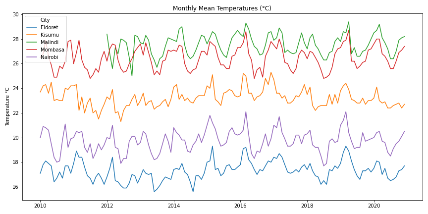
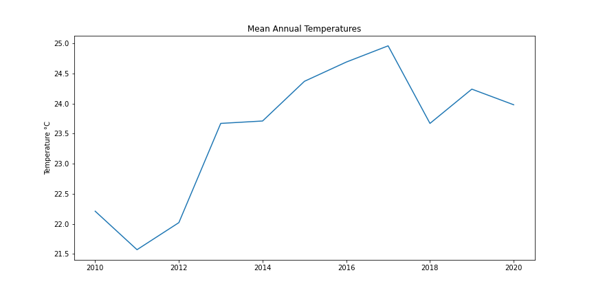
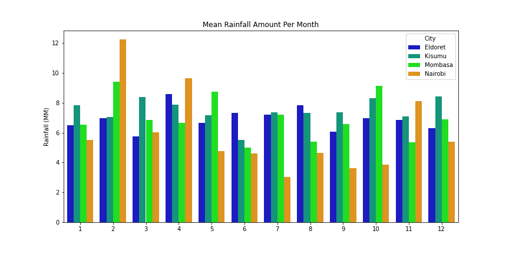
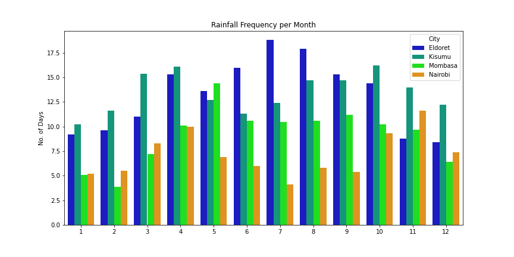

### Introduction
In this analysis I use data from **Reliable Prognosis [website](https://rp5.ru/).** to look at the weather patterns in major towns in Kenya.
The selected cities are distributed across Kenya as shown below. 
Mombasa and Malindi are located in the coast region while Kisumu and Eldoret are located in the western region.

#### a) Temperature
The mean temperature values have remained similar for all the counties over the last decade. As expected, the towns along the coast(Mombasa and Malindi) have the highest temperatures. Eldoret has remained the coldest city throughout followed by Nairobi

Using the temperatures for the 5 cities, we can see that Nairobi temperatures ranged between 22°C and 25°C.

#### b) Rainfall 
The cities received between 4mm and 8mm of rainfall on average over the years.

Eldoret however has the highest number of rainy days per month.

