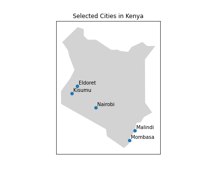

### Introduction
In this analysis I use data from **Reliable Prognosis [website](https://rp5.ru/).** to look at the weather patterns in major towns in Kenya.
The selected cities are distributed across Kenya as shown below.

Mombasa and Malindi are located in the coast region while Kisumu and Eldoret are located in the western region.

